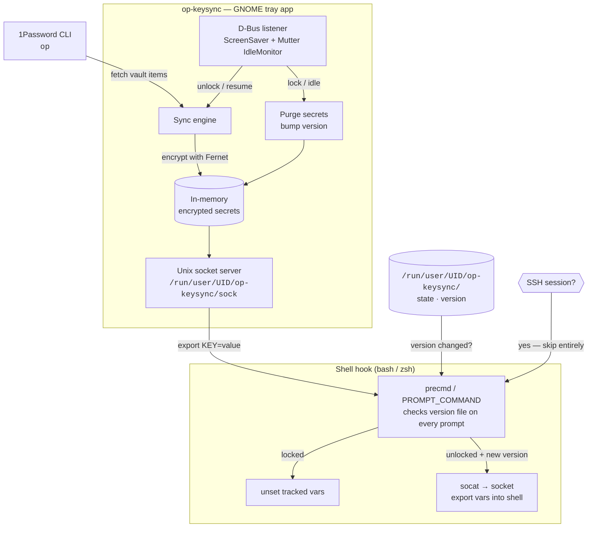

# op-keysync

A GNOME tray app that fetches API keys from 1Password and injects them as environment variables into your local shell sessions — with automatic purge on screen lock and idle timeout.

## Install

```bash
# 1. Add the GPG key
curl -fsSL https://dkmaker.github.io/apikeymanager/gpg.key \
  | sudo gpg --dearmor -o /usr/share/keyrings/op-keysync.gpg

# 2. Add the repository
echo "deb [arch=all signed-by=/usr/share/keyrings/op-keysync.gpg] \
  https://dkmaker.github.io/apikeymanager stable main" \
  | sudo tee /etc/apt/sources.list.d/op-keysync.list

# 3. Install
sudo apt update && sudo apt install op-keysync
```

Then launch **1Password Key Sync** from your GNOME app menu.

> Full installation details, requirements, and 1Password vault setup: see [INSTALL.md](INSTALL.md)

## How it works

- **Secrets live only in RAM** — encrypted with Fernet (AES-128-CBC), key generated fresh at startup, never written to disk
- **On startup** — auto-syncs from 1Password after 2 seconds
- **On screen lock** — secrets purged from memory → all local shells unset vars on next prompt
- **On 60 min idle** — same purge, triggered by no keyboard/mouse input via Mutter idle monitor
- **On unlock / activity resumes** — 1Password queried automatically, fresh keys loaded → shells re-inject
- **Manual sync** — "Full Sync" in tray menu fetches from 1Password on demand
- **Clipboard** — copy value or `KEY=VALUE` from tray submenu, auto-cleared after 20 seconds
- **SSH sessions denied** — shell hook checks `$SSH_CONNECTION` and skips entirely

## Security model

| Concern | How it's handled |
|---|---|
| Keys on disk | Never written — `/run/user/$UID/` is tmpfs (RAM only) |
| Keys in keyring | Not used — no `secret-tool`, no GNOME keyring |
| SSH access | Shell hook checks `$SSH_CONNECTION` and skips entirely |
| Screen lock | D-Bus `org.gnome.ScreenSaver.ActiveChanged` triggers immediate purge |
| Idle timeout | D-Bus `org.gnome.Mutter.IdleMonitor` purges after 60 min no input |
| Socket access | Socket is `chmod 600`, owner-only |
| Key values in menu | Never shown in header — values only accessible via submenu |
| Clipboard | Values passed via `wl-copy` stdin (never in process args), auto-cleared after 20s |

## Tray icon

| Colour | Meaning |
|---|---|
| 🟢 Green | Unlocked, keys loaded |
| 🔴 Red | Screen locked, keys purged |
| 🟠 Orange | Sync error |
| 🔵 Blue | Currently syncing |
| 🟡 Amber | Secret copied to clipboard, waiting 20s auto-clear |
| ⚪ Grey | Running, no keys yet |

## Architecture



## Troubleshooting

```bash
# Check daemon is running
ls /run/user/$UID/op-keysync/

# Check state
cat /run/user/$UID/op-keysync/state

# Test socket manually
printf 'GET\n' | socat -t2 - UNIX-CONNECT:/run/user/$UID/op-keysync/sock

# Debug log
tail -f ~/.local/share/op-keysync/debug.log

# Test 1Password CLI
op item list --vault Exports --format json
```

## Known limitations

- **Clipboard clear-on-paste** — not possible on GNOME Wayland (Mutter doesn't support `wlr-data-control`). Uses 20-second auto-clear instead, same as 1Password, KeePassXC and Bitwarden.
- **GTK3** — required because `AyatanaAppIndicator` (system tray) has no GTK4 support.
